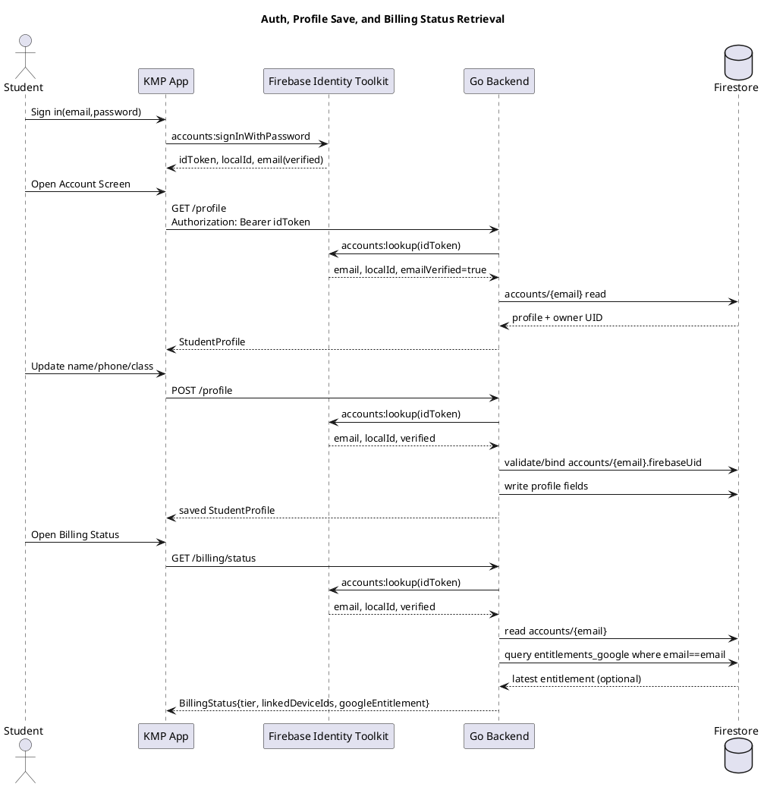
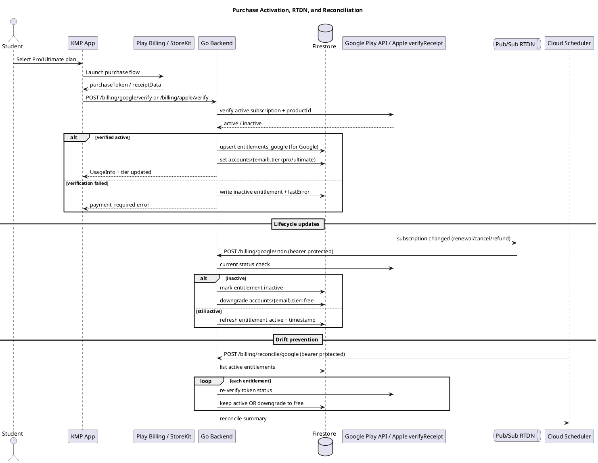

# Smart Study Buddy: End-to-End Design, Validation, and Deployment

This document describes the production-ready architecture and operating model for Smart Study Buddy, including:

- End-to-end system design
- Security and entitlement controls
- Billing lifecycle handling (Google Play + App Store)
- Verification and validation strategy
- Deployment and rollout process

---

## 1) Goals and scope

### Product goals

- Deliver multilingual (English/Hindi/Tamil) NEET tutoring with image-assisted Q&A.
- Enforce freemium usage and paid entitlement tiers (`free`, `pro`, `ultimate`).
- Support account continuity across devices with secure identity binding.
- Run reliably in production with observability and incident response controls.

### In-scope components

- KMP mobile app (`kmp-app/composeApp`)
- Go tutor backend (`services/tutor-go`)
- Firestore persistence
- Google Play and App Store billing verification integrations
- RTDN/webhook and reconciliation flows
- Telemetry/analytics and crash reporting hooks

---

## 2) High-level architecture

## 2.1 Client (KMP app)

- Compose Multiplatform UI (`App.kt`) with platform `androidMain`/`iosMain` integrations.
- Authentication via Firebase Auth REST:
  - Sign-up/sign-in to obtain Firebase ID token.
  - Token attached as `Authorization: Bearer <idToken>` for protected backend endpoints.
- Billing:
  - Android: Play Billing client flow.
  - iOS: StoreKit flow + receipt capture.
- Tier/usage UI:
  - Daily usage badge and free-tier paywall behavior.
  - Upgrade prompt with verification retry UX.
- Telemetry:
  - Conversion events (`upgrade_prompt_opened`, `plan_selected`, `purchase_captured`, `purchase_activated`, etc.).
  - Error capture hooks for purchase/tutor failures.

## 2.2 Backend (Go service)

- Public endpoint: `POST /tutor`.
- Protected account/billing endpoints:
  - `POST /auth/link`
  - `POST /auth/restore`
  - `GET /profile`
  - `POST /profile`
  - `GET /billing/status`
  - `POST /billing/google/verify`
  - `POST /billing/apple/verify`
- Operations and lifecycle endpoints:
  - `POST /billing/google/rtdn`
  - `POST /billing/apple/notifications`
  - `POST /billing/reconcile/google`
- Optional debug endpoint (locked by env):
  - `POST /tier` only if `ALLOW_TIER_ENDPOINT=true`

## 2.3 Persistence and cloud services

- Firestore collections:
  - `devices/{deviceId}`: usage counter, count date, tier, linked email.
  - `accounts/{email}`: tier, linked device IDs, profile fields (`studentName`, `phoneNumber`, `classLevel`), Firebase UID ownership.
  - `entitlements_google/{tokenHash}`: purchase token mapping and latest verification state.
- **Ops — complimentary / scholarship tier:** `infra/grant-complimentary-tier.sh` (Python, stdlib + `gcloud` token) updates `accounts/{email}.tier` to `pro` or `ultimate` (or `free` to revoke). Uses `--dry-run` first; optional `--reason` writes `complimentaryReason` + `complimentaryGrantedAt` for audit. Requires `GOOGLE_CLOUD_PROJECT` (or `--project`) and Firestore write access.
- Cloud Run hosts backend service.
- Secret Manager stores production secrets.
- Pub/Sub + Cloud Scheduler support RTDN and periodic reconciliation.

---

## 3) Domain model and entitlement rules

## 3.1 Tier model

- `free`: daily limited questions, stripped premium response fields.
- `pro`: unlimited usage.
- `ultimate`: unlimited usage.

## 3.2 Account ownership binding

- Identity source: Firebase ID token.
- Backend verifies:
  1. Token validity
  2. Email presence
  3. Email verified flag
  4. Stable `localId` (Firebase UID)
- Account record stores `firebaseUid`.
- On subsequent requests, UID must match stored owner UID.

Result: prevents simple email-only takeover and enforces ownership continuity.

## 3.3 Upgrade source of truth

- Production entitlement changes must flow via verified store endpoints:
  - Google: `POST /billing/google/verify`
  - Apple: `POST /billing/apple/verify`
- Debug override endpoint `/tier` is disabled by default in production.

---

## 4) End-to-end runtime flows

## 4.1 Ask tutor flow

1. App sends `POST /tutor` with prompt/language/device ID and optional image base64.
2. Backend increments usage and checks daily limit.
3. If under limit:
   - Calls Gemini model.
   - Applies free-tier response stripping if tier is `free`.
4. Returns `TutorResponse` + `usage`.
5. App updates usage state and (platform-specific) voice playback.

## 4.2 Account link/restore flow

1. User signs in via Firebase Auth in app.
2. App calls:
   - Link: `POST /auth/link`
   - Restore: `POST /auth/restore`
3. Backend validates token and ownership UID mapping.
4. Tier/account linkage is restored to current device.

## 4.3 Purchase activation flow

1. User selects plan in app.
2. Store purchase succeeds and returns verification artifact:
   - Android purchase token or iOS receipt data.
3. App calls backend verify endpoint with auth token.
4. Backend validates store purchase status and product ID.
5. Backend sets account tier and returns updated usage/tier.
6. App updates UI and tracks `purchase_activated`.

## 4.4 Renewal/cancel/refund lifecycle flow

- Google RTDN:
  - Play -> Pub/Sub -> `POST /billing/google/rtdn`.
  - Backend re-checks current subscription status.
  - On inactive status, downgrades account tier to `free`.
- Apple server notifications:
  - App Store Server Notifications -> `POST /billing/apple/notifications`.
  - Endpoint currently ingests and logs events; integrate signed payload parsing policy for full automation.
- Reconciliation:
  - Scheduler-triggered `POST /billing/reconcile/google`.
  - Backend revalidates active entitlements and corrects drift.

## 4.5 Profile storage and billing retrieval flow

- Profile data write/read:
  - App -> `POST /profile` / `GET /profile`
  - Backend stores/reads in `accounts/{email}`.
  - Email is derived from verified Firebase token; request body email cannot override identity.
- Billing status read:
  - App -> `GET /billing/status`
  - Backend returns:
    - effective account tier from `accounts/{email}.tier`
    - linked device IDs from `accounts/{email}.deviceIds`
    - latest Google entitlement summary from `entitlements_google` (if available)
  - This endpoint is protected and ownership-validated by Firebase UID binding.

---

## 5) Security and hardening posture

## 5.1 AuthN/AuthZ

- Bearer Firebase ID token is mandatory for protected user endpoints.
- Email-verified users only.
- UID ownership binding protects account mutation.

## 5.2 Secret management

Use Secret Manager-backed deployment variables:

- `GOOGLE_GENAI_API_KEY`
- `FIREBASE_WEB_API_KEY`
- `APPLE_SHARED_SECRET`
- `GOOGLE_RTDN_BEARER_TOKEN`
- `APPLE_SERVER_NOTIFICATIONS_BEARER_TOKEN`
- `RECONCILE_BEARER_TOKEN`

`infra/deploy-go-tutor.sh` supports `*_SECRET` indirection for these.

## 5.3 Endpoint protection

- `/tier` disabled by default via `ALLOW_TIER_ENDPOINT=false`.
- Lifecycle endpoints protected with dedicated bearer tokens.

---

## 6) Observability and analytics

## 6.1 Product conversion analytics (client)

Tracked events include:

- `upgrade_prompt_opened`
- `plan_selected`
- `purchase_captured`
- `purchase_activated`
- `purchase_verification_failed`
- `purchase_cancelled`
- `purchase_error`

## 6.2 Reliability telemetry

- Android:
  - Firebase Analytics
  - Firebase Crashlytics exception logging
- iOS:
  - Structured `NSLog` telemetry hooks

## 6.3 Logs and alerts

- Cloud Run logs for backend API and billing lifecycle endpoints.
- Configure Firebase/Cloud alerts for:
  - Crash spikes
  - Verification failure surge
  - Reconciliation downgrade spikes

---

## 7) Verification and validation strategy

## 7.1 Unit-level checks (developer gate)

- Go backend: `go build ./...`
- Android compile: `./gradlew :composeApp:compileDebugKotlinAndroid`
- iOS compile: `./gradlew :composeApp:compileKotlinIosSimulatorArm64`

## 7.2 API functional checks

Use token-authenticated test calls for:

- `POST /auth/link`, `POST /auth/restore`
- `GET/POST /profile`
- `GET /billing/status`
- `POST /billing/google/verify`
- `POST /billing/apple/verify`
- `POST /billing/google/rtdn`
- `POST /billing/reconcile/google`

Expected outcomes:

- Unauthorized requests fail with 401.
- UID mismatch fails with 403.
- Invalid purchase artifacts fail with payment-required error payload.
- Successful verification updates tier and usage response.

## 7.3 Billing lifecycle validation

Android:

1. Run internal test purchase.
2. Confirm activation in app.
3. Trigger cancel and verify RTDN-based downgrade.
4. Run reconcile job and confirm idempotent final state.

iOS:

1. Run sandbox/TestFlight purchase.
2. Verify backend `/billing/apple/verify` activation.
3. Send/observe server notifications.
4. Validate downgrade behavior once notification parsing automation is finalized.

## 7.4 End-to-end smoke test matrix

- Free tier daily limit and UTC reset.
- Pro/Ultimate activation.
- Restore on new device with same account.
- Offline and poor network handling.
- Purchase verification retry UX.
- Cancel/refund downgrade behavior.
- Voice output on Android and iOS.

---

## 8) Deployment model

## 8.1 Prerequisites

- GCP project with APIs enabled:
  - `run.googleapis.com`
  - `cloudbuild.googleapis.com`
  - `firestore.googleapis.com`
  - `artifactregistry.googleapis.com`
  - `logging.googleapis.com`
  - `secretmanager.googleapis.com`
  - `androidpublisher.googleapis.com`
  - `pubsub.googleapis.com`
  - `cloudscheduler.googleapis.com`
- Firestore database created.
- Secret Manager entries provisioned.

## 8.2 Backend deployment

```bash
export GOOGLE_CLOUD_PROJECT="smart-study-buddy-490413"
export GOOGLE_CLOUD_REGION="asia-south1"

# Recommended: secret indirection
export GOOGLE_GENAI_API_KEY_SECRET="google-genai-api-key"
export FIREBASE_WEB_API_KEY_SECRET="firebase-web-api-key"
export APPLE_SHARED_SECRET_SECRET="apple-shared-secret"
export GOOGLE_RTDN_BEARER_TOKEN_SECRET="google-rtdn-bearer-token"
export APPLE_SERVER_NOTIFICATIONS_BEARER_TOKEN_SECRET="apple-notifications-bearer-token"
export RECONCILE_BEARER_TOKEN_SECRET="reconcile-bearer-token"

export ALLOW_TIER_ENDPOINT="false"

./infra/deploy-go-tutor.sh
```

## 8.3 RTDN and reconciliation wiring

- Configure Play RTDN topic and push subscription to:
  - `POST /billing/google/rtdn`
- Configure Cloud Scheduler HTTP job to:
  - `POST /billing/reconcile/google`

Include bearer token headers from secrets.

## 8.4 App release deployment

- Android:
  - Build signed release AAB.
  - Upload to internal testing first.
  - Validate purchase flow and telemetry before broad rollout.
- iOS:
  - Build TestFlight release.
  - Validate sandbox/TestFlight purchase and backend verification.

---

## 9) Rollout and rollback strategy

## 9.1 Staged rollout

1. Deploy backend changes.
2. Validate health + protected endpoint auth.
3. Run internal purchase lifecycle tests.
4. Roll out app to limited audience.
5. Expand rollout after telemetry and error rates are stable.

## 9.2 Rollback

- Cloud Run revision rollback:
  - Route traffic back to previous stable revision.
- App rollback:
  - Pause staged rollout.
  - Promote previous stable build if needed.
- Data safety:
  - Reconcile endpoint can restore entitlement consistency after incidents.

---

## 10) Current known gaps / next hardening

- Implement full Apple signed server notification payload verification and automated entitlement transitions.
- Add idempotency keys + audit trail for billing verification endpoints.
- Finalize least-privilege IAM review for runtime service account.
- Complete legal/compliance artifacts (privacy, terms, data safety forms).

---

## 11) Quick readiness checklist

- [ ] `/tier` disabled in production (`ALLOW_TIER_ENDPOINT=false`)
- [ ] All sensitive env values sourced from Secret Manager
- [ ] Play products/base plans active and tested
- [ ] App Store products configured and tested
- [ ] RTDN + scheduler reconciliation active
- [ ] Crash/analytics dashboards and alerts configured
- [ ] Internal QA smoke matrix passed
- [ ] Staged rollout plan approved

---

## 12) Sequence diagrams (PlantUML)

### 12.1 Auth + profile + billing status retrieval



### 12.2 Purchase activation + lifecycle + reconciliation



